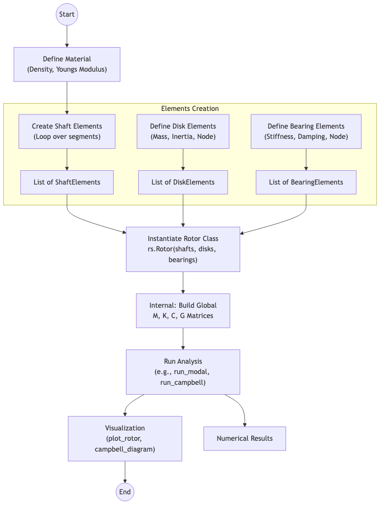
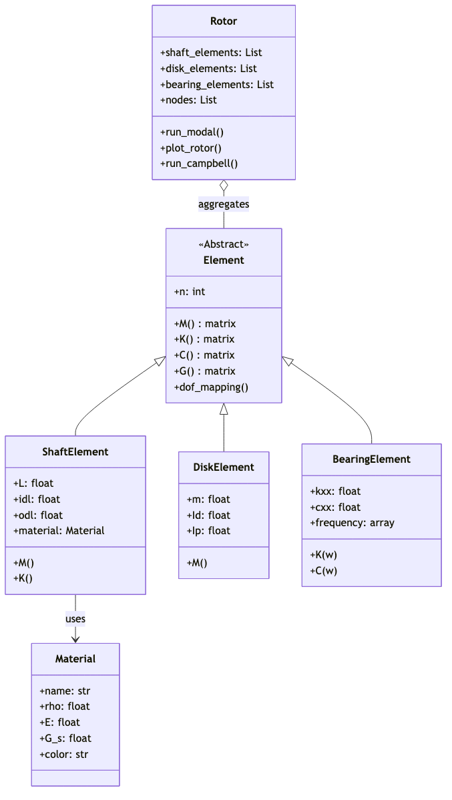
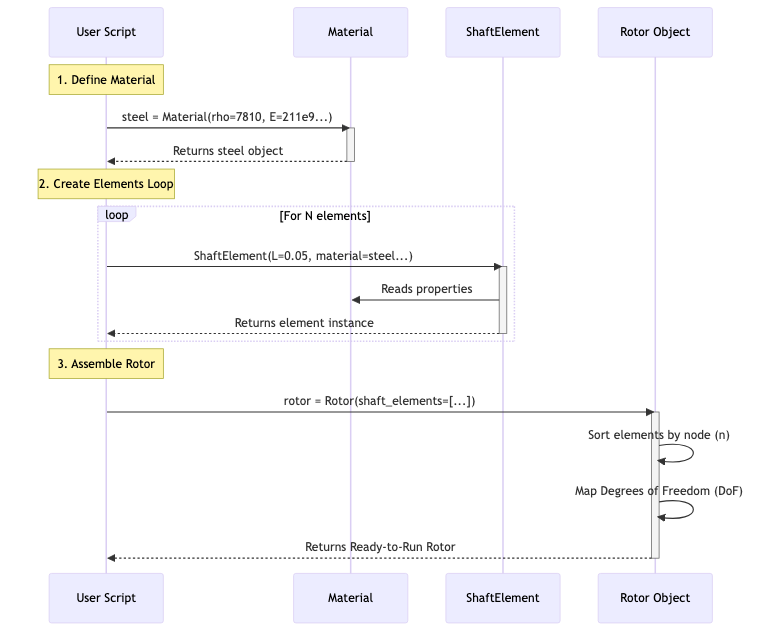
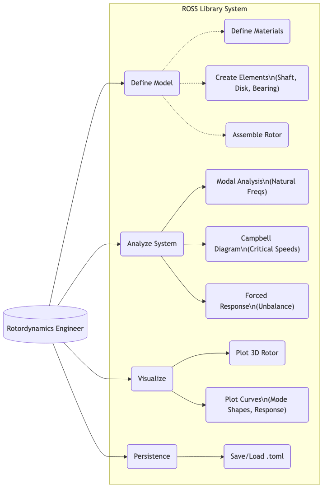

# ROSS Library Architecture Analysis

This document provides an in-depth analysis of the **ROSS (Rotordynamics Open Source Software)** library architecture, intended to help users understand how the code is structured and executed.

## 1. Library Architecture Overview

The core logic of ROSS relies on the **Finite Element Method (FEM)**.

*   **Base Abstraction (`Element`)**: All physical components inherit from a generic abstract class `Element`. This ensures every component knows how to calculate its own Mass (`M`), Stiffness (`K`), Damping (`C`), and Gyroscopic (`G`) matrices.
*   **Component Classes**:
    *   **`ShaftElement`**: Models a segment of the rotor shaft (often using Timoshenko beam theory). It links to a `Material`.
    *   **`DiskElement`**: Represents rigid disks (impellers, gears) as lumped mass and inertia.
    *   **`BearingElement`**: Represents bearings/seals with stiffness and damping coefficients.
*   **The Assembler (`Rotor`)**: The `Rotor` class acts as the "System Manager". It takes lists of elements, assigns them to nodes (finite element stations), and stitches their local matrices into global system matrices to solve the equations of motion:
    $$ M\ddot{q} + (C + G)\dot{q} + Kq = F $$

---

## 2. Execution Flowchart

The following flowchart illustrates how a typical script runs, from defining materials to visualizing results.

### Explanation
1.  **Define Material**: Set up physical properties (density, modulus).
2.  **Create Elements**: Generate lists of shaft segments, disks, and bearings.
3.  **Instantiate Rotor**: The `Rotor` class aggregates these elements.
4.  **Build Matrices**: The `Rotor` object internally assembles the global matrices.
5.  **Run Analysis**: Execute solvers like `run_modal()` or `run_campbell()`.

---

## 3. UML Class Diagram

This diagram displays the relationships between the core classes. Notice how `Rotor` is an aggregation of `Element` objects.

### Key Relationships
*   **Inheritance**: `ShaftElement`, `DiskElement`, and `BearingElement` all inherit from `Element`.
*   **Aggregation**: `Rotor` contains lists of these elements.
*   **Dependency**: `ShaftElement` uses `Material` to define its physical properties.

---

## 4. Instantiation Diagram (Object Creation)

This sequence diagram illustrates the "Creation" phase, showing how distinct objects are created in memory and passed to the `Rotor` constructor.

### Steps
1.  **Material Creation**: The user script creates a material object.
2.  **Element Loop**: Shaft elements are created iteratively, referencing the material.
3.  **Rotor Assembly**: The list of elements is passed to the `Rotor`, which maps degrees of freedom (DoF) and prepares for analysis.

---

## 5. Use Case Diagram

This diagram maps out the typical workflow from the engineer's perspective: from defining the physics to running specific analyses and visualizing data.

### core Use Cases
1.  **Define Model**: Assembling the rotor from materials and elements.
2.  **Analyze System**: Running modal, Campbell, or forced response analyses.
3.  **Visualize**: Plotting the 3D rotor model or analysis curves.

---

## 6. Summary

1.  **Inputs**: You start by defining physical properties (materials) and geometry (dimensions).
2.  **Discretization**: You break the real-world object into "Elements". A continuous shaft becomes a list of `ShaftElement`s.
3.  **Assembly**: The `Rotor` class acts as the "Solver". You don't manually calculate the mass matrix of the whole system; you just hand the `Rotor` the parts, and it assembles the physics mathematically.
4.  **Analysis**: Once the `Rotor` object exists, you ask it questions like "What are your natural frequencies?" (`run_modal()`) or "What do you look like?" (`plot_rotor()`).

