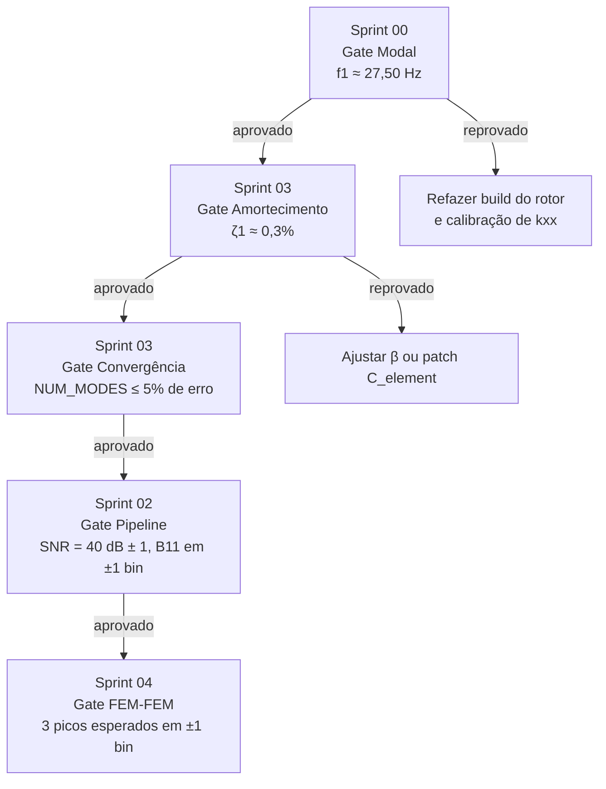

# Planejamento — Modelagem Numérica e Validação (§3.2)

> Detalhamento operacional do objetivo específico **§3.2 — Modelagem
> Numérica e Validação** de
> [`00_planejamento_global.md`](00_planejamento_global.md). Este
> documento traduz, em pt-BR, o programa de execução em inglês descrito
> em [`../01_planejamento_científico/sprints_executivos/`](../01_planejamento_científico/sprints_executivos/)
> (Sprints 00–03), conectando-o às tarefas T05–T08 de
> [`research_tasks.md`](research_tasks.md) e aos critérios
> metodológicos de [`02_metodologia_cientifica.md`](02_metodologia_cientifica.md).
>
> **Última revisão:** 2026-05-21.

---

## 1. Objetivo do estágio

Reproduzido literalmente de [`00_planejamento_global.md`](00_planejamento_global.md#32-modelagem-numérica-e-validação):

> - Construir modelos de elementos finitos de um sistema rotor-mancal
>   utilizando a biblioteca ROSS, incluindo efeitos giroscópicos, rigidez
>   e amortecimento dos mancais.
> - Implementar o modelo de trinca respirante com rigidez variável no
>   tempo (modelo Mayes–Davies e Gash).
> - Implementar o modelo de forçamento por desalinhamento com excitação
>   harmônica em 1X, 2X e 3X.
> - Validar os modelos desenvolvidos comparando frequências naturais e
>   resposta ao desbalanceamento com dados publicados na literatura.

O estágio é **bloqueante** para todas as etapas posteriores (§3.3
DoE, §3.4 análise HOS, §3.5 diagnóstico, §3.6 validação contra
literatura). Sem um modelo numérico calibrado, qualquer afirmação
quantitativa sobre indicadores bispectrais (BPR, BCS, BE, bifase) fica
suscetível a viés de modelagem que não pode ser separado do efeito da
falha.

## 2. Premissas e referência experimental

O artigo de referência é **Sinha (2007), *Higher Order Spectra for
Crack and Misalignment Identification in the Shaft of a Rotating
Machine*** (`99_references/Sinha - 2007 - ...pdf`). Toda a geometria,
condições de operação e protocolo de aquisição seguem o artigo,
exceto onde explicitamente justificado.

| Parâmetro | Valor adotado | Origem |
|---|---|---|
| Eixo: comprimento × diâmetro | 550 mm × 10 mm, aço sólido | Sinha §3 |
| Material | E = 211 GPa; G = 81,1 GPa; ρ = 7810 kg/m³ | Sinha §3 |
| Mancais (posições) | nós em 20 mm e 510 mm | Sinha §3 |
| Disco de balanceamento | OD/ID/L = 75/10/25 mm, meia-vão | Sinha §3 |
| Nó da trinca (`CRACK_NODE`) | 315 mm a partir do mancal 1 | Sinha §3 |
| Sonda (`PROBE_NODE`) | 490 mm — um elemento a montante do mancal 2 | Sinha §3 |
| 1ª frequência natural (alvo) | **f₁ = 27,50 Hz** (impulso experimental) | Sinha §3 |
| 1ª frequência natural — trinca aberta | 26,25 Hz (vertical) | Sinha §3 |
| Razão de amortecimento modal | **ζ₁ = 0,3 %** (proporcional à rigidez) | Sinha §5 |
| Profundidade da trinca | a/D = 0,5 | Sinha §3 |
| Desalinhamento (offsets) | δx = 1,0 mm; δy = 0,5 mm | Sinha §3.2 |
| Razão sinal-ruído | SNR = 40 dB (AWGN) | Sinha §5 |

> **Decisão registrada (Sprint 00).** A calibração da rigidez de
> mancal `kxx` toma como alvo a frequência **experimental** de 27,50 Hz
> (Sinha §3) — e não os 26,53 Hz do FEM próprio de Sinha (§5). Os
> 26,53 Hz são artefato de uma viga coarser e servem apenas como
> referência qualitativa para a Fig. 10 do artigo.

## 3. Etapa 1 — Modelo FEM do rotor-mancal em ROSS

**Tarefa associada:** T05 em [`research_tasks.md`](research_tasks.md).
**Sprints de execução:** [`00_modal_validation.md`](../01_planejamento_científico/sprints_executivos/00_modal_validation.md)
e [`03_damping_and_modal_truncation.md`](../01_planejamento_científico/sprints_executivos/03_damping_and_modal_truncation.md).

### 3.1 Atividades

1. **Construção do rotor** em
   [`02_simula/00_sinha_rotor.ipynb`](../02_simula/00_sinha_rotor.ipynb):
   - 13 nós ao longo do eixo; `ShaftElement` padrão da ROSS (Euler–
     Bernoulli, 4 DOF/nó), com efeitos giroscópicos, inércia rotativa
     e cisalhamento habilitados.
   - Disco no nó intermediário (`DISK_NODE = 6`) com massa e inércia
     calculadas a partir das dimensões 75/10/25 mm.
   - Mancais isotrópicos (`kxx = kyy = k_opt`) calibrados via
     `scipy.optimize.brentq` no resíduo `f₁(k) − 27,50 Hz`.
   - Persistência em `02_simula/sinha_rotor.toml` por
     `rotor.save("sinha_rotor.toml")`.

2. **Verificação de consistência** entre o `node_pos_mm` do notebook
   00 e os índices fixos em [`02_simula/constants.py`](../02_simula/constants.py)
   (`DISK_NODE`, `CRACK_NODE`, `BEARING_*_NODE`, `PROBE_NODE`).
   Asserções em cada notebook downstream (`assert
   rotor.disk_elements[0].n == DISK_NODE`) garantem que a
   discretização do eixo não saia de sincronia com as constantes.

3. **Amortecimento proporcional** (Sprint 03):
   - Patch `C = α·M + β·K` com α = 0 e β ajustado por `brentq` para
     atingir ζ₁ = 0,3 % no primeiro modo.
   - Backup do TOML anterior em `sinha_rotor_pre_damping.toml`
     (rastreabilidade).
   - Reasserção do critério modal (f₁ não pode se mover além de 0,05
     Hz quando β passa a ser não-nulo, pois ζ pequeno desloca apenas
     a frequência amortecida `ω_d`, não `ω_n`).

4. **Convergência por truncamento modal:** comparar |B₁₁|, |B₂₂|,
   |B₁₂| obtidos com `num_modes ∈ {12, 24, 36}` para uma simulação de
   referência (trinca a 750 rpm). Adotar o menor `NUM_MODES` que
   atenda 5 % de desvio relativo em relação ao caso de 36 modos.
   Resultado tabulado em
   [`../01_planejamento_científico/sprints_executivos/`](../01_planejamento_científico/sprints_executivos/)
   `03_convergence_table.md`.

### 3.2 Critério de aceitação

- `|f₁_atual − 27,50| ≤ 0,05 Hz` em `rotor.run_modal(speed=0)`
  (Sprint 00, Célula A).
- `|ζ₁ − 0,003| ≤ 5·10⁻⁴` após calibração de amortecimento
  (Sprint 03).
- `NUM_MODES` escolhido converge as amplitudes |B₁₁|, |B₂₂|, |B₁₂|
  dentro de 5 % do caso 36-modos.
- `sinha_rotor.toml` e `sinha_rotor_pre_damping.toml` ambos versionados
  em git.

## 4. Etapa 2 — Modelo de trinca respirante (Mayes–Davies e Gash)

**Tarefa associada:** T06.
**Notebook de referência:**
[`02_simula/03_sinha_crack_model_comparison.ipynb`](../02_simula/03_sinha_crack_model_comparison.ipynb).

### 4.1 Atividades

1. **Modelo Mayes–Davies.** Variação senoidal da rigidez:
   `K(θ) = K_o − f(θ)·(K_o − K_c)`, com `f(θ) = ½(1 − cos θ)`. Essa
   é exatamente a expressão `(1 − cos θ)·Δk/2` utilizada por Sinha §5
   no FEM próprio dele — coincidência adotada como argumento de
   validade do mapeamento Mayes → Sinha. Implementado na ROSS via
   `Crack(..., crack_model="Mayes")` (`run_crack(..., crack_model="Mayes")`
   no `run_campaign.py`).

2. **Modelo Gash (comparativo).** Função de chaveamento da forma
   `f(θ) = 1` para `|θ| < π/2` e `f(θ) = 0` caso contrário, gerando
   variação brusca da rigidez quando a trinca cruza a região
   tracionada. Servirá como **comparação metodológica** com o modelo
   Mayes nas mesmas condições de operação (a/D = 0,5; 750 rpm);
   espera-se que o Gash gere conteúdo harmônico mais rico (mais
   degraus na rigidez) e, portanto, super-harmônicos bispectrais mais
   intensos.

3. **Rigidez aberta (K_c).** Construída a partir dos coeficientes de
   flexibilidade de Papadopoulos (mecânica da fratura linear),
   já implementados na ROSS. Para a/D = 0,5 obtém-se uma queda de
   rigidez vertical de ≈ 30 % no nó da trinca quando a fissura está
   totalmente aberta.

4. **Verificação de comportamento.** Em ângulo `θ` que minimiza
   `K(θ)[0,0]` (próximo de 180°), espera-se que a 1ª frequência
   natural caia para ≈ 26,25 Hz (Sinha §3, vertical). Essa verificação
   é qualitativa no Sprint 00 (apenas inspeciona a forma de `K(θ)`) e
   torna-se quantitativa no Sprint 04 (Fig. 10 do artigo).

### 4.2 Critério de aceitação

- O perfil de rigidez vs ângulo (`K(θ)`) reproduz a função `(1−cos θ)/2`
  do Sinha §5 — verificação visual já feita em
  [`03_sinha_crack_model_comparison.ipynb`](../02_simula/03_sinha_crack_model_comparison.ipynb).
- A simulação `run_crack` em a/D = 0,5 e 772,5 rpm produz órbita
  tipo *loop-containing-small-loop* (Sinha Fig. 9) — exit criterion
  do Sprint 04.
- Comparação Mayes vs Gash documentada (ao menos um gráfico de
  espectro de amplitude lado-a-lado nas mesmas condições) com
  justificativa para adotar Mayes como modelo de referência da
  campanha — a unicidade Mayes ↔ Sinha §5 é o motivo de não usar
  `Flex Open` / `Flex Breathing` (cf. *non-goals* do programa de
  sprints).

## 5. Etapa 3 — Modelo de desalinhamento (1X, 2X, 3X)

**Tarefa associada:** T07.
**Sprint de execução:**
[`06_misalignment_hos.md`](../01_planejamento_científico/sprints_executivos/06_misalignment_hos.md).

### 5.1 Atividades

1. **Acoplamento flexível (Xia et al., 2019).** Implementação via
   `rotor.run_misalignment(coupling="flex", mis_type="parallel")`.
   A geometria com seis parafusos do modelo gera componentes
   harmônicas 1X, 2X (pequena) e 3X superpostos ao desbalanceamento
   residual.

2. **Parâmetros do acoplamento:**
   - `radial_stiffness = 4·10⁴ N/m`
   - `bending_stiffness = 3,8·10⁴ N·m/rad`
   - `mis_distance_x = 1,0 mm; mis_distance_y = 0,5 mm`
   - `mis_angle = 0` (paralelo, sem componente angular nesta fase).
   - Os valores são herdados de `04_sinha_fault_analysis.ipynb`; como
     Sinha não publica rigidez de acoplamento, esses parâmetros entram
     na **análise de sensibilidade** do Sprint 06: variar
     `radial_stiffness ∈ {1·10⁴, 4·10⁴, 1·10⁵}` quando o critério
     de presença de B₁₃ falhar.

3. **Contribuição original.** Sinha (2007) escreve em §5: *"the force
   function due to the shaft misalignment is not well stood"* — i.e.,
   ele **não consegue simular** desalinhamento via FEM. Esta etapa,
   portanto, **estende** o escopo do artigo: a comparação das Figs. 4,
   6 e 8 (experimentais em Sinha) com a saída do
   `run_misalignment` é a evidência mais forte de originalidade da
   dissertação.

### 5.2 Critério de aceitação

Quatro critérios falsificáveis no Sprint 06, executados em 750 e
900 rpm:

- `|B₂₂|/|B₁₁| ≤ 0,10` em ambas velocidades — B22 **ausente**.
- `|B₁₃|/|B₁₁| ≥ 0,15` em ambas velocidades — B13 (= B31) **presente**.
- Topologia do bi-espectro idêntica entre 750 e 900 rpm
  (independência de velocidade).
- Apenas T₁₁₁ aparece no tri-espectro acima do limiar 0,10.

## 6. Etapa 4 — Validação contra literatura

**Tarefa associada:** T08.
**Sprints de execução:**
[`00_modal_validation.md`](../01_planejamento_científico/sprints_executivos/00_modal_validation.md),
[`02_acquisition_long_records.md`](../01_planejamento_científico/sprints_executivos/02_acquisition_long_records.md),
[`04_sinha_fe_replication.md`](../01_planejamento_científico/sprints_executivos/04_sinha_fe_replication.md).

### 6.1 Validação modal

Comparação de frequências naturais contra a Tabela 1 de Sinha
(2007):

| Caso | Sinha §3 (exp.) | Sinha §5 (FEM) | Alvo ROSS | Tolerância |
|---|---|---|---|---|
| Íntegro, 1ª flexão | 27,50 Hz | 26,53 Hz | 27,50 Hz | ±0,05 Hz |
| Trinca aberta, vertical | 26,25 Hz | 25,75 Hz | 26,25 Hz | ±0,30 Hz |
| Trinca aberta, horizontal | — | 26,10 Hz | 26,10 Hz | qualitativo |

A tolerância para o caso íntegro é apertada porque controla a
calibração de `kxx`; a tolerância para o caso de trinca aberta é mais
generosa porque envolve uma rotação adicional do rotor para
identificar `θ_open` e uma análise modal com a trinca travada
(executada apenas no Sprint 04, conforme nota da Célula B do Sprint 00).

### 6.2 Validação por resposta ao desbalanceamento

Simulação determinística com `UNB_MAG = 2·10⁻⁴ kg·m` (valor único
declarado em `constants.py`, substituindo o `3π/4` antigo no notebook
04 — cf. nota de procedência em [`02_metodologia_cientifica.md`](02_metodologia_cientifica.md)):

- A curva de resposta ao desbalanceamento deve apresentar pico em
  `f₁ ≈ 27,5 Hz` (rotação crítica em ≈ 1650 rpm) com amplitude
  consistente com a literatura (ordem de grandeza de mícrons a poucas
  dezenas de mícrons no nó da sonda).
- Verificação topológica da órbita a 772,5 rpm (Sinha Fig. 9) — o
  *loop-containing-small-loop* deve aparecer com a/D = 0,5.

### 6.3 Pipeline de aquisição e ruído (Sprint 02)

A validação só é defensável se a aquisição numérica reproduzir o
encadeamento experimental de Sinha:

| Etapa | Valor | Origem |
|---|---|---|
| Passo de integração `dt_sim` | 1/10000 s | Sinha §5 |
| Comprimento do registro `T_LONG` | 25 s (+ 2 s descartados como transiente) | Estimador HOS |
| Filtro anti-alias | Butterworth 8ª ordem, fase-zero, fc = 1 kHz | Sinha §3, §5 |
| Frequência pós-decimação | 2560 Hz (experimental) ou 1000 Hz (FEM Sinha) | Sinha §3 / §5 |
| Ruído branco gaussiano | SNR = 40 dB | Sinha §5 |
| Estimador bispectro | 50 segmentos, 50 % overlap, Δf = 1,25 Hz | Sinha §3.3 |

Persistência em `02_simula/results/campaign.h5`, um grupo por caso,
metadados `(condition, speed_rpm, ross_version, timestamp, case_id)`
nos atributos do grupo (Sprint 02). Os notebooks de análise (Sprints
04–06) abrem o HDF5 em modo leitura — **não há ressimulação
acidental**.

## 7. Mapa de gates e critérios de saída

Cada gate produz um artefato verificável:

- **Sprint 00** → `02_simula/00a_modal_check.ipynb` + constante
  `SINHA_MODAL_TARGET = 27.50` exportada em `constants.py`.
- **Sprint 03** → `02_simula/sinha_rotor.toml` (re-salvo) +
  `02_simula/sprints/03_convergence_table.md` + constante
  `NUM_MODES` em `constants.py`.
- **Sprint 02** → `02_simula/run_campaign.py` + `results/campaign.h5`
  com 7 grupos mínimos (3 saudável + 2 trinca + 2 desalinhamento).
- **Sprint 04** → `02_simula/07_sinha_fig10_replication.ipynb` +
  `reports/sinha_fig10_side_by_side.pdf`.

## 8. Riscos identificados e mitigação

| Risco | Probabilidade | Impacto | Mitigação |
|---|---|---|---|
| `kxx` calibrado em 27,50 Hz não converge no `brentq` | Baixa | Bloqueante | Diagnóstico já validado em `00_sinha_rotor.ipynb`; bracket `[1e5, 1e9] N/m` cobre o intervalo físico. |
| Caminho de amortecimento (bearing-C vs shaft-C) não cobre ζ₁ = 0,3 % | Média | Alto | Plano dual no Sprint 03: tenta primeiro `cxx` (mais simples), cai para patch `β·K_element` (mais fiel a Sinha §5). |
| `num_modes = 12` não converge para HOS em 900 rpm | Média | Médio | Tabela de convergência no Sprint 03 dispara aumento automático para 24 ou 36. |
| `run_misalignment` com `radial_stiffness = 4·10⁴` não gera B13 | Média | Alto (nova contribuição) | Varredura `radial_stiffness ∈ {1·10⁴, 4·10⁴, 1·10⁵}`; falha persistente é resultado científico (limitação de modelagem) e deve ser **reportada**, não escondida. |
| Geometria do rotor em `00_sinha_rotor.ipynb` se desvia da de Sinha | Baixa | Alto | Asserções em cascata (`assert rotor.disk_elements[0].n == DISK_NODE`); recap de procedência fixo nos notebooks downstream. |
| Mistura silenciosa de `Q_(...)` (pint) com floats puros | Média | Médio (numérico) | Convenção do projeto: chamar `.m` ou `.to("unit").m` no ponto de uso; documentado em `CLAUDE.md`. |

## 9. Cronograma estimado

Tomando como base os efforts declarados nos sprints
correspondentes (calendário sequencial; paralelização ocorre apenas
na fase de aplicação HOS, fora deste estágio):

| Sprint | Atividade | Esforço |
|---|---|---|
| 00 | Validação modal — `f₁ = 27,50 Hz` | ½ dia |
| 01 | Núcleo HOS (`signal_utils`, `plot_utils`) | 5 dias |
| 02 | Pipeline de aquisição + HDF5 | 3 dias |
| 03 | Amortecimento + convergência modal | 2 dias |
| 04 | Reprodução FEM-FEM de Sinha (Figs. 9 e 10) | 3–5 dias |
| **Total estimado** | | **≈ 14 dias úteis** |

A barra mais larga é a etapa 04, que valida em conjunto todas as
escolhas anteriores. Se o Sprint 04 falhar, a depuração volta aos
Sprints 00–03 antes que qualquer dado de DoE (§3.3 Fase 2) seja
gerado — *non-goal* explícito do programa de sprints é "no full DoE
on an unvalidated pipeline".

## 10. Rastreabilidade

| Item deste documento | Documento-fonte |
|---|---|
| §1 Objetivo | [`00_planejamento_global.md`](00_planejamento_global.md) §3.2 |
| §2 Premissas / Sinha | `99_references/Sinha - 2007 - ...pdf` |
| §3 Rotor + amortecimento + convergência | Sprints [00](../01_planejamento_científico/sprints_executivos/00_modal_validation.md), [03](../01_planejamento_científico/sprints_executivos/03_damping_and_modal_truncation.md) |
| §4 Trinca Mayes / Gash | [`02_simula/03_sinha_crack_model_comparison.ipynb`](../02_simula/03_sinha_crack_model_comparison.ipynb); Sinha §5 |
| §5 Desalinhamento | Sprint [06](../01_planejamento_científico/sprints_executivos/06_misalignment_hos.md); Xia et al. (2019) |
| §6 Validação | Sprints [00](../01_planejamento_científico/sprints_executivos/00_modal_validation.md), [02](../01_planejamento_científico/sprints_executivos/02_acquisition_long_records.md), [04](../01_planejamento_científico/sprints_executivos/04_sinha_fe_replication.md) |
| §7 Gates | [`../01_planejamento_científico/sprints_executivos/README.md`](../01_planejamento_científico/sprints_executivos/README.md) |
| §8 Riscos | [`02_simula/05_synthesis.ipynb`](../02_simula/05_synthesis.ipynb) (auditoria H1, H4) |
| Tarefas T05–T08 | [`research_tasks.md`](research_tasks.md) |
| Classificação metodológica | [`02_metodologia_cientifica.md`](02_metodologia_cientifica.md) §3.2, §3.3 |

## 11. Referências

- Sinha, J. K. (2007). *Higher Order Spectra for Crack and
  Misalignment Identification in the Shaft of a Rotating Machine.*
  Structural Health Monitoring 6(4), 325–334.
- Mayes, I. W., & Davies, W. G. R. (1984). *Analysis of the response
  of a multi-rotor-bearing system containing a transverse crack in a
  rotor.* ASME J. of Vibration, Acoustics, Stress and Reliability in
  Design 106.
- Gash, R. (1993). *A survey of the dynamic behaviour of a simple
  rotating shaft with a transverse crack.* J. of Sound and Vibration
  160(2).
- Papadopoulos, C. A. (2008). *The strain energy release approach for
  modeling cracks in rotors: A state of the art review.* Mechanical
  Systems and Signal Processing 22(4).
- Xia, Y., Pang, J., Yang, L., Zhao, Q., & Yang, X. (2019). *Study on
  vibration response and orbits of misaligned rigid rotors connected
  by hexangular flexible coupling.* Applied Acoustics 155.
- Timbó, R., et al. (2020). *ROSS — Rotordynamic Open Source
  Software.* Journal of Open Source Software 5(48).
- Lalanne, M., & Ferraris, G. (1998). *Rotordynamics Prediction in
  Engineering.* 2ª ed., Wiley.
- Ewins, D. J. (2000). *Modal Testing: Theory, Practice and
  Application.* 2ª ed., Research Studies Press.
