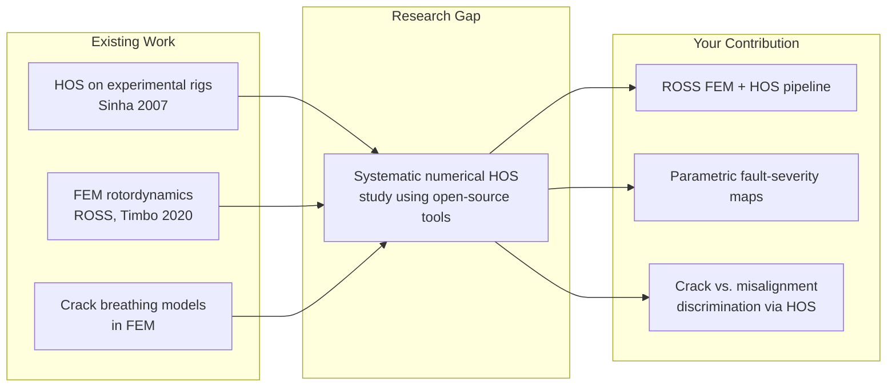
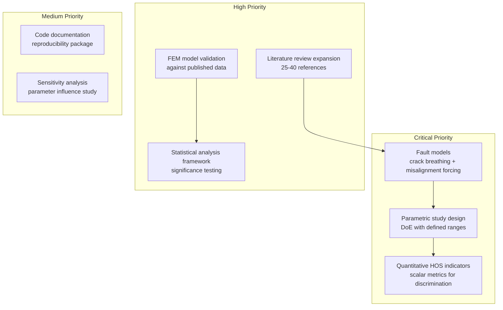
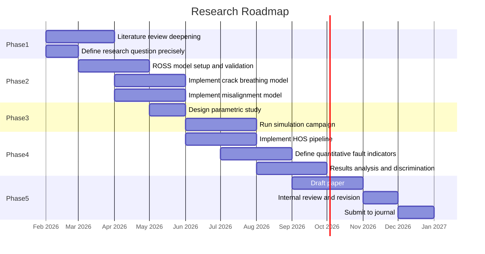
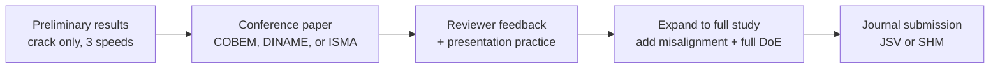
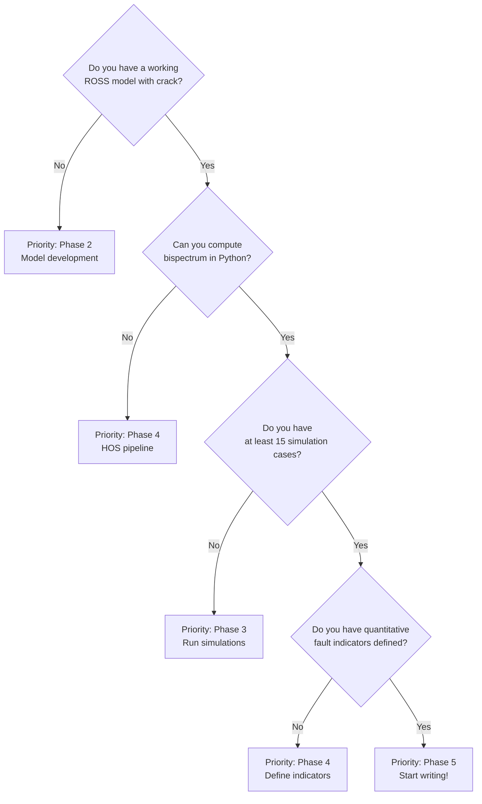

# Publication Roadmap: Fault Diagnosis in Rotating Machines via Numerical Simulations and Higher-Order Spectra Analysis

> **Author:** Cristofer Antoni Souza Costa
> **Program:** M.Sc. Mechanical Engineering (POSMEC) -- UFU
> **Advisor:** Prof. Dr. Aldemir Aparecido Cavallini Junior
> **Date:** February 2026

---

## Table of Contents

1. [Engineering Problem Understanding](#1-engineering-problem-understanding)
2. [Engineering Contribution Classification](#2-engineering-contribution-classification)
3. [Engineering Publishability Check (CRITICAL)](#3-engineering-publishability-check-critical)
4. [Gap Analysis Toward a Publishable Paper](#4-gap-analysis-toward-a-publishable-paper)
5. [Engineering Research Roadmap](#5-engineering-research-roadmap)
6. [Paper Structure for Engineering Journals](#6-paper-structure-for-engineering-journals)
7. [Fastest Path to Acceptance (Engineering Mode)](#7-fastest-path-to-acceptance-engineering-mode)
8. [Progress Tracking Checklist](#8-progress-tracking-checklist)
9. [Risk Assessment](#9-risk-assessment)

---

## 1. Engineering Problem Understanding

### 1.1 The Industrial Context

Rotating machines (turbines, compressors, pumps, generators) are the backbone of energy, oil & gas, aerospace, and manufacturing industries. Unplanned downtime from rotor faults costs industries billions annually. The two most common fault modes are:

| Fault Type | Mechanism | Industrial Impact |
|---|---|---|
| **Shaft Crack** | Fatigue-induced transverse crack that "breathes" during rotation, introducing nonlinear stiffness variation | Catastrophic failure if undetected; risk of shaft rupture |
| **Misalignment** | Angular or parallel offset between coupled shafts | Bearing degradation, seal failure, elevated vibration |

Both faults generate **nonlinear dynamic signatures** -- and this is where Higher-Order Spectra (HOS) become relevant.

### 1.2 Why Higher-Order Spectra?

Traditional vibration analysis relies on the **Power Spectral Density (PSD)**, which is a second-order statistic. PSD is blind to:

- **Phase coupling** between harmonics (e.g., the 1X-2X coupling caused by a breathing crack)
- **Non-Gaussian features** in the vibration signal
- **Nonlinear interactions** that distinguish a crack from misalignment

HOS (bispectrum, trispectrum) are third- and fourth-order statistics that preserve phase information and can detect quadratic and cubic nonlinearities. This makes them theoretically superior for distinguishing faults that produce similar frequency content but different nonlinear coupling patterns.

```
Traditional approach:         HOS approach:
Signal --> FFT --> PSD        Signal --> FFT --> Bispectrum / Trispectrum
       (amplitude only)              (amplitude + phase coupling)
       Cannot distinguish             CAN distinguish nonlinear
       crack vs misalignment          signatures of each fault
```

### 1.3 The Simulation-vs-Experiment Tradeoff

Most published HOS studies for rotating machinery (including Sinha, 2007) rely on **small experimental rigs**. This creates limitations:

- Experiments are expensive and time-consuming
- Difficult to isolate a single fault type with known severity
- Limited parametric coverage (one rig = one configuration)
- Poor reproducibility across labs

**The proposed approach** uses numerical simulation via the ROSS library (Timbo et al., 2020) to:

- Generate controlled vibration data for known fault types and severities
- Systematically sweep parameters (crack depth, misalignment angle, rotational speed)
- Provide a fully reproducible, open-source workflow
- Enable validation against published experimental data

This is the core value proposition of the research.

---

## 2. Engineering Contribution Classification

### 2.1 Contribution Type Matrix

| Contribution Axis | Classification | Strength |
|---|---|---|
| **Primary** | Methodology -- simulation-based HOS fault diagnosis pipeline | Medium-High |
| **Secondary** | Computational tool integration (ROSS + HOS in open-source Python) | Medium |
| **Tertiary** | Parametric study -- systematic mapping of HOS features vs. fault parameters | High (if done well) |

### 2.2 Novelty Assessment



**What exists:**
- Sinha (2007) applied HOS to experimental data from a small rig and showed promising but limited results for crack vs. misalignment distinction.
- ROSS provides open-source FEM rotordynamics but has not been used with HOS analysis.
- Many FEM-based rotordynamics studies exist, but they typically use PSD or orbit plots -- not HOS.

**What is new:**
- The combination of ROSS-based FEM simulation with HOS analysis as a reproducible, open-source diagnostic methodology.
- A systematic parametric study mapping bispectral features to fault type and severity.
- Quantitative metrics (not just visual bispectrum plots) for fault classification.

### 2.3 Contribution Level Verdict

This research sits at the intersection of **applied methodology** and **computational investigation**. It is NOT a fundamental theory contribution, and that is perfectly fine for a master's thesis and a solid journal paper. The key is to demonstrate that the methodology produces actionable, quantifiable results that advance the state-of-the-art beyond "proof of concept" experimental HOS studies.

---

## 3. Engineering Publishability Check (CRITICAL)

This is the most important section. An honest assessment determines whether you are building toward a publishable paper or just a thesis chapter.

### 3.1 Publishability Scorecard

| Criterion | Status | Score (1-5) | Notes |
|---|---|---|---|
| **Clear research question** | Defined | 4 | "Can HOS applied to numerical simulations reliably distinguish crack vs. misalignment in rotating shafts?" |
| **Novelty** | Partial | 3 | Combination is novel; individual components are not |
| **Methodology rigor** | Not yet defined | 2 | Need parametric study design, metrics, statistical analysis |
| **Validation** | Planned (literature) | 2 | Need quantitative comparison, not just qualitative |
| **Reproducibility** | High potential | 5 | Open-source tools (ROSS + Python) |
| **Practical relevance** | Strong | 4 | Direct industrial application |
| **Writing quality** | Not started | -- | -- |
| **Overall** | -- | **~3.3** | **Publishable with significant work** |

### 3.2 Critical Gate: What Would Make a Reviewer Reject This?

1. **"This is just applying known HOS formulas to ROSS output."**
   - Mitigation: You must add engineering insight -- quantitative fault indicators, sensitivity analysis, and a classification framework.

2. **"No experimental validation."**
   - Mitigation: (a) Validate your FEM model against published experimental frequency responses, (b) compare your HOS patterns with Sinha's experimental bispectrum plots, (c) clearly state "numerical investigation" scope.

3. **"The parametric study is too narrow."**
   - Mitigation: Design a proper Design of Experiments (DoE) covering crack depth ratios (a/D = 0.1 to 0.5), misalignment angles, rotational speeds, and damping levels.

4. **"No quantitative metric for fault discrimination."**
   - Mitigation: Define scalar HOS-based indicators (e.g., bicoherence peak ratios, bispectral entropy, integrated bispectrum in specific frequency bands).

### 3.3 Publishability Verdict

**PUBLISHABLE -- conditionally.** The research idea is sound and the niche is real. However, the current proposal describes a workflow, not a study with quantifiable outcomes. The transformation from "workflow description" to "publishable paper" requires adding:

1. A parametric simulation campaign
2. Quantitative HOS-based fault indicators
3. A discrimination/classification analysis (crack vs. misalignment vs. healthy)
4. Proper validation against at least one published experimental dataset

---

## 4. Gap Analysis Toward a Publishable Paper

### 4.1 What the Proposal Has vs. What the Paper Needs

| Element | Proposal Status | Paper Requirement | Gap |
|---|---|---|---|
| Problem statement | General description | Sharp, specific research question | Needs sharpening |
| Literature review | 3 references | 25-40 references covering HOS theory, rotordynamics FEM, fault diagnosis state-of-art | Major gap |
| FEM model | "Will use ROSS" | Validated FEM model with documented parameters (shaft geometry, bearings, discs) | Needs implementation + validation |
| Fault modeling | "Cracks and misalignment" | Breathing crack model (Mayes-Davies or similar), misalignment forcing model with mathematical description | Major gap |
| Simulation design | Not specified | Design of Experiments: parameter ranges, number of cases, convergence study | Major gap |
| HOS computation | "Will apply HOS" | Documented algorithm (DFT-based bispectrum estimation, window selection, segment averaging, statistical significance) | Major gap |
| Fault indicators | Not defined | Quantitative scalar metrics extracted from HOS (bicoherence, bispectral entropy, frequency-band integration) | Major gap |
| Results analysis | "Will compare with literature" | Statistical comparison, confusion matrix or discrimination metrics, sensitivity curves | Major gap |
| Validation | "Literature comparison" | Quantitative benchmarking against at least one published experimental case | Needs definition |
| Reproducibility | ROSS is open-source | Full code and data availability statement | Easy to add |

### 4.2 Literature Review Expansion Needed

The paper needs references in these categories:

| Category | Key Topics to Cover | Estimated References |
|---|---|---|
| Rotordynamics fundamentals | Shaft FEM, bearing models, Campbell diagrams | 4-6 |
| Crack breathing models | Mayes-Davies, switching, harmonic balance | 3-5 |
| Misalignment modeling | Coupling forces, harmonic excitation models | 2-3 |
| HOS theory | Bispectrum definition, estimation, properties | 3-4 |
| HOS in rotating machinery | Sinha's work and subsequent studies | 4-6 |
| Fault diagnosis methods (comparison) | EMD, wavelet, machine learning approaches | 3-5 |
| Numerical fault diagnosis studies | FEM-based vibration analysis for fault detection | 3-5 |
| ROSS / open-source rotordynamics | ROSS documentation, validation studies | 2-3 |

**Total target: 25-40 references**

### 4.3 Gap Priority Ranking



---

## 5. Engineering Research Roadmap

### 5.1 Phase Overview



### 5.2 Phase Details

#### Phase 1: Foundation (Months 1-3)

**Objective:** Build the theoretical and literature foundation.

| Task | Deliverable | Duration |
|---|---|---|
| Deep literature review on HOS in rotating machinery | Annotated bibliography (25-40 papers) | 6 weeks |
| Study HOS theory (bispectrum estimation, bicoherence, statistical properties) | Summary document with key equations | 3 weeks |
| Study ROSS library: API, examples, capabilities and limitations | Working ROSS notebook with basic rotor model | 2 weeks |
| Study crack breathing models (Mayes-Davies, switching stiffness) | Mathematical formulation document | 2 weeks |
| Sharpen research question into a testable hypothesis | Written hypothesis statement | 1 week |

**Key learning resources:**
- Nikias & Petropulu, "Higher-Order Spectra Analysis" (1993) -- the HOS bible
- Randall, "Vibration-based Condition Monitoring" (2011)
- ROSS documentation and examples: https://ross.readthedocs.io

#### Phase 2: Model Development (Months 3-5)

**Objective:** Build and validate the numerical models.

| Task | Deliverable | Duration |
|---|---|---|
| Build baseline healthy rotor model in ROSS | Validated FEM model (natural frequencies match published data) | 3 weeks |
| Implement breathing crack model | Crack model integrated with ROSS (time-varying stiffness) | 4 weeks |
| Implement misalignment forcing model | Misalignment model producing known harmonic forcing | 3 weeks |
| Model validation: compare natural frequencies and unbalance response with published data | Validation plots and error metrics | 2 weeks |

**Critical decision:** ROSS may or may not support time-varying stiffness (breathing crack) natively. If not, you will need to implement a custom time-stepping scheme or modify the stiffness matrix externally at each time step. Investigate this early.

#### Phase 3: Simulation Campaign (Months 5-7)

**Objective:** Generate the numerical dataset.

**Parametric study design (suggested):**

| Parameter | Range | Steps | Rationale |
|---|---|---|---|
| Crack depth ratio (a/D) | 0.0 (healthy), 0.1, 0.2, 0.3, 0.4, 0.5 | 6 | Covers incipient to severe |
| Misalignment angle | 0.0 (healthy), 0.5, 1.0, 1.5, 2.0 degrees | 5 | Covers typical industrial range |
| Rotational speed | 0.5x, 0.75x, 1.0x, 1.25x, 1.5x critical speed | 5 | Captures sub- and super-critical behavior |
| Damping ratio | 0.01, 0.02, 0.05 | 3 | Assesses robustness to damping uncertainty |

**Total simulations:** ~6 x 5 x 5 x 3 = 450 cases (manageable for FEM time integration).

Each simulation produces a time-domain vibration signal (displacement at a measurement point). Store all signals in a structured format (HDF5 or NumPy arrays).

#### Phase 4: HOS Analysis and Results (Months 6-9)

**Objective:** Extract, analyze, and classify HOS features.

| Task | Deliverable | Duration |
|---|---|---|
| Implement bispectrum estimation (DFT-based, with segment averaging) | Python module for bispectrum computation | 3 weeks |
| Implement bicoherence computation | Normalized bispectral measure | 1 week |
| Define quantitative fault indicators from HOS | At least 3 scalar metrics (see below) | 2 weeks |
| Apply HOS pipeline to all simulation cases | Feature matrix (N_cases x N_features) | 2 weeks |
| Discrimination analysis: healthy vs. crack vs. misalignment | Confusion matrix, ROC curves, or classification accuracy | 3 weeks |
| Sensitivity analysis: how do HOS indicators vary with fault severity? | Sensitivity curves (indicator vs. parameter) | 2 weeks |

**Suggested quantitative HOS indicators:**

1. **Bispectral Peak Ratio (BPR):** Ratio of bispectrum magnitude at (1X, 1X) to (1X, 2X). Different for crack vs. misalignment.
2. **Bicoherence Sum (BCS):** Sum of squared bicoherence over a defined frequency region. Measures total nonlinear coupling.
3. **Bispectral Entropy (BE):** Shannon entropy of the normalized bispectrum. Measures complexity of nonlinear interactions.
4. **Phase of Bispectrum at key frequencies:** The biphase at (1X, 1X) and (1X, 2X) can distinguish fault types.

#### Phase 5: Paper Writing and Submission (Months 9-12)

**Objective:** Write and submit the journal paper.

| Task | Deliverable | Duration |
|---|---|---|
| Draft Introduction and Literature Review | 3-4 pages | 2 weeks |
| Draft Methodology (FEM model + HOS pipeline) | 4-5 pages | 2 weeks |
| Draft Results and Discussion | 5-7 pages | 3 weeks |
| Draft Conclusions | 1 page | 1 week |
| Prepare figures (publication quality, vector format) | 10-15 figures | 2 weeks |
| Internal review (advisor + colleagues) | Revised manuscript | 3 weeks |
| Prepare supplementary material (code repository, data) | GitHub repo / Zenodo archive | 1 week |
| Submit to target journal | Confirmation email | -- |

---

## 6. Paper Structure for Engineering Journals

### 6.1 Target Journals (Ranked by Fit)

| Journal | Impact Factor (approx.) | Fit | Review Time | Notes |
|---|---|---|---|---|
| **Mechanical Systems and Signal Processing** | ~8.0 | Excellent | 3-6 months | Top choice for signal processing + mechanical systems |
| **Journal of Sound and Vibration** | ~4.7 | Very good | 3-5 months | Strong rotordynamics community |
| **Structural Health Monitoring** | ~5.7 | Good | 3-6 months | Where Sinha (2007) published |
| **Mechanism and Machine Theory** | ~5.2 | Good | 2-4 months | If focus is on the mechanical modeling |
| **Journal of Vibration and Acoustics (ASME)** | ~2.0 | Good | 2-4 months | Lower IF but respected; faster review |
| **Latin American Journal of Solids and Structures** | ~1.5 | Moderate | 2-3 months | Regional; good for first publication |

**Recommendation:** Target **Journal of Sound and Vibration** or **Structural Health Monitoring** as primary. Keep **ASME J. Vib. Acoust.** or **Latin American J. Solids Struct.** as backup options.

### 6.2 Paper Outline (Section-by-Section)

```
TITLE: Fault Diagnosis in Rotating Shafts Using Higher-Order Spectra 
       Applied to Finite Element Simulations: A Numerical Investigation

ABSTRACT (250 words max)
- Problem: Fault detection in rotating machinery
- Gap: HOS studies are limited to small experimental rigs
- Method: FEM simulation (ROSS) + bispectrum/bicoherence analysis
- Key result: Quantitative HOS indicators discriminate crack vs. misalignment
- Impact: Reproducible, open-source methodology

1. INTRODUCTION (1.5-2 pages)
   1.1 Rotating machinery and fault diagnosis importance
   1.2 Traditional vibration analysis limitations
   1.3 Higher-Order Spectra: theory and motivation
   1.4 Literature review: HOS in rotating machinery
   1.5 Research gap and objectives
   1.6 Paper organization

2. THEORETICAL BACKGROUND (2-3 pages)
   2.1 Rotordynamics FEM formulation
       - Equation of motion: M*q'' + (C + G)*q' + K*q = f(t)
       - Gyroscopic effects, bearing stiffness/damping
   2.2 Breathing crack model
       - Time-varying stiffness: K(t) = K0 - Delta_K * f(theta(t))
       - Mayes-Davies or switching model description
   2.3 Misalignment model
       - Harmonic forcing at 1X, 2X, 3X
   2.4 Higher-Order Spectra
       - Bispectrum: B(f1,f2) = E[X(f1)*X(f2)*X*(f1+f2)]
       - Bicoherence: b^2(f1,f2) = |B(f1,f2)|^2 / [E|X(f1)X(f2)|^2 * E|X(f1+f2)|^2]
       - Estimation: segment averaging, window selection

3. METHODOLOGY (3-4 pages)
   3.1 Rotor-bearing system description
       - Shaft geometry, disc properties, bearing parameters
       - ROSS model setup (with figure)
   3.2 Fault implementation
       - Crack: breathing function, depth ratios
       - Misalignment: forcing model, offset values
   3.3 Simulation campaign design
       - Parameter ranges and DoE table
       - Time integration settings (time step, duration, steady-state extraction)
   3.4 HOS processing pipeline
       - Signal preprocessing (detrending, windowing)
       - Bispectrum estimation parameters (segment length, overlap, window)
       - Fault indicator definitions (BPR, BCS, BE, biphase)
   3.5 Model validation
       - Comparison of natural frequencies with published data
       - Unbalance response validation

4. RESULTS AND DISCUSSION (5-7 pages)
   4.1 Baseline (healthy) rotor response
       - Frequency response, orbit plots, PSD
   4.2 Cracked shaft response
       - Time response, PSD showing 2X and 3X harmonics
       - Bispectrum maps for different crack depths
       - Bicoherence patterns
   4.3 Misaligned shaft response
       - Time response, PSD showing 2X harmonics
       - Bispectrum maps for different misalignment levels
       - Bicoherence patterns
   4.4 Comparison: crack vs. misalignment HOS signatures
       - Side-by-side bispectrum comparison
       - Quantitative indicator comparison (BPR, BCS, BE)
   4.5 Sensitivity analysis
       - Indicators vs. crack depth
       - Indicators vs. misalignment level
       - Indicators vs. rotational speed
       - Effect of damping
   4.6 Fault discrimination performance
       - Classification accuracy or separability metrics
   4.7 Comparison with published experimental results
       - Qualitative and quantitative comparison with Sinha (2007)

5. CONCLUSIONS (1 page)
   5.1 Summary of key findings
   5.2 Practical implications
   5.3 Limitations
   5.4 Future work (experimental validation, machine learning integration)

ACKNOWLEDGMENTS

REFERENCES (25-40 entries)

APPENDIX (optional)
   - ROSS model parameters
   - HOS estimation algorithm pseudocode
   - Link to code repository
```

### 6.3 Figure Plan

| Fig. # | Description | Type |
|---|---|---|
| 1 | Rotor-bearing system schematic (ROSS model) | Schematic |
| 2 | Breathing crack model: stiffness vs. rotation angle | Line plot |
| 3 | Campbell diagram (natural frequencies vs. speed) | Line plot |
| 4 | Baseline response: time signal + PSD | Dual panel |
| 5 | Cracked shaft: time signal + PSD for different crack depths | Multi-panel |
| 6 | Cracked shaft: bispectrum magnitude maps (2D color maps) | 2x2 grid |
| 7 | Misaligned shaft: time signal + PSD | Multi-panel |
| 8 | Misaligned shaft: bispectrum magnitude maps | 2x2 grid |
| 9 | Bicoherence comparison: healthy vs. crack vs. misalignment | 1x3 grid |
| 10 | Fault indicators vs. crack depth | Line plot with markers |
| 11 | Fault indicators vs. misalignment level | Line plot with markers |
| 12 | Fault indicators vs. rotational speed | Line/contour plot |
| 13 | Discrimination scatter plot (indicator 1 vs. indicator 2, colored by fault type) | Scatter plot |
| 14 | Comparison with Sinha (2007) experimental bispectrum | Side-by-side comparison |

---

## 7. Fastest Path to Acceptance (Engineering Mode)

### 7.1 Minimum Viable Paper (MVP) Strategy

If time is limited, here is the **minimum scope** that is still publishable:

| Element | MVP Scope | Full Scope |
|---|---|---|
| Fault types | Crack only | Crack + Misalignment |
| Parameter sweep | 5 crack depths x 3 speeds = 15 cases | Full DoE (450 cases) |
| HOS analysis | Bispectrum only | Bispectrum + trispectrum |
| Indicators | 2 indicators (BPR + BCS) | 4+ indicators |
| Validation | Qualitative comparison with Sinha (2007) | Quantitative + additional references |
| Classification | Visual discrimination (scatter plot) | Statistical classification metrics |

**MVP timeline: approximately 6-8 months** (vs. 10-12 for full scope).

### 7.2 Conference-First Strategy (Recommended)

A powerful de-risking strategy:



**Benefits:**
- Early publication on your CV
- Feedback from peer reviewers before the journal submission
- Conference presentation builds credibility and networking

**Target conferences:**
- COBEM (Brazilian Congress of Mechanical Engineering) -- national, good for first exposure
- DINAME (International Symposium on Dynamic Problems in Mechanics) -- Latin American, rotordynamics focus
- ISMA (International Conference on Noise and Vibration Engineering) -- international, strong SHM track
- IFToMM (International Conference on Rotor Dynamics) -- top international rotordynamics venue

### 7.3 Open-Source Advantage

Make your code and data publicly available. This is a **major differentiator** for reviewers:

- Host code on GitHub (your existing `research_UFU` repository)
- Archive a release on Zenodo for a permanent DOI
- Include a "Data Availability Statement" and "Code Availability Statement" in the paper
- Reviewers in 2026 increasingly value reproducibility

### 7.4 Fastest Path Decision Tree



---

## 8. Progress Tracking Checklist

### Phase 1: Foundation

- [ ] Complete literature review (25+ papers read and annotated)
- [ ] Write annotated bibliography document
- [ ] Study HOS theory: understand bispectrum estimation, bicoherence, statistical significance
- [ ] Study ROSS library: run tutorial examples, understand API
- [ ] Formulate precise research question / hypothesis
- [ ] Study breathing crack models: Mayes-Davies, switching stiffness
- [ ] Study misalignment forcing models
- [ ] Discuss scope with advisor and agree on parametric study design

### Phase 2: Model Development

- [✓] Build baseline healthy rotor model in ROSS (shaft + disc + bearings)
- [✓] Validate baseline model: compare natural frequencies with published data
- [ ] Validate unbalance response against known solutions (Bode)
- [✓] Implement breathing crack model (time-varying stiffness matrix)
- [✓] Verify crack model: check 2X and 3X harmonics appear in PSD
- [✓] Implement misalignment forcing model
- [✓] Verify misalignment model: check expected harmonic pattern
- [ ] Document all model parameters (geometry, material, bearing coefficients)

### Phase 3: Simulation Campaign

- [ ] Design parametric study: define parameter ranges and number of cases
- [ ] Set up automated simulation script (loop over parameters)
- [ ] Choose time integration settings (time step, total duration, steady-state window)
- [ ] Run healthy baseline simulations
- [ ] Run cracked shaft simulations (all parameter combinations)
- [ ] Run misaligned shaft simulations (all parameter combinations)
- [ ] Store results in structured format (HDF5 / NumPy)
- [ ] Verify data quality: spot-check time signals and PSDs

### Phase 4: HOS Analysis

- [ ] Implement bispectrum estimation algorithm in Python
- [ ] Validate bispectrum code against known analytical signals
- [ ] Implement bicoherence computation
- [ ] Define quantitative fault indicators (BPR, BCS, BE, biphase)
- [ ] Apply HOS pipeline to all simulation cases
- [ ] Build feature matrix (N_cases x N_features)
- [ ] Analyze HOS patterns: healthy vs. crack vs. misalignment
- [ ] Generate sensitivity curves: indicators vs. fault severity
- [ ] Perform discrimination analysis: separability of fault classes
- [ ] Compare results with Sinha (2007) experimental data

### Phase 5: Paper Writing

- [ ] Draft Abstract
- [ ] Draft Introduction (problem, gap, objectives)
- [ ] Draft Theoretical Background (FEM, crack model, HOS)
- [ ] Draft Methodology (model setup, simulation design, HOS pipeline)
- [ ] Draft Results and Discussion
- [ ] Draft Conclusions
- [ ] Prepare all figures in publication quality (vector format, consistent style)
- [ ] Prepare tables
- [ ] Write data/code availability statement
- [ ] Internal review by advisor
- [ ] Revise based on advisor feedback
- [ ] Format according to target journal template
- [ ] Submit to journal
- [ ] Prepare code repository for public release

---

## 9. Risk Assessment

### 9.1 Risk Matrix

| ID | Risk | Probability | Impact | Severity | Category |
|---|---|---|---|---|---|
| R1 | ROSS does not support time-varying stiffness for crack modeling | Medium | High | **High** | Technical |
| R2 | Bispectrum does not show clear differentiation between crack and misalignment in numerical data | Low-Medium | Critical | **Critical** | Technical |
| R3 | Reviewer perceives contribution as "just applying known methods" | Medium | High | **High** | Publication |
| R4 | Insufficient literature on numerical HOS studies makes positioning difficult | Low | Medium | **Medium** | Publication |
| R5 | Simulation campaign takes too long (convergence issues, parameter explosion) | Medium | Medium | **Medium** | Timeline |
| R6 | HOS estimation is sensitive to signal length, noise, and windowing -- results are unstable | Medium | High | **High** | Technical |
| R7 | Advisor or committee requests scope changes mid-project | Low | Medium | **Medium** | Timeline |
| R8 | No experimental validation weakens the paper for top-tier journals | High | Medium | **High** | Publication |

### 9.2 Mitigation Strategies

#### R1: ROSS Time-Varying Stiffness

- **Investigate early** (Phase 2, first task): Check if ROSS supports time-domain integration with time-dependent matrices.
- **Fallback A:** Implement a custom Newmark-beta or Runge-Kutta integrator that updates the stiffness matrix at each time step using ROSS's FEM matrices.
- **Fallback B:** Use a different FEM library (e.g., custom Python code with SciPy) for the crack case, and ROSS for baseline/misalignment.
- **Fallback C:** Model the crack effect as an external periodic force (approximate linearization) rather than time-varying stiffness.

#### R2: Weak HOS Differentiation (CRITICAL)

This is the existential risk. If the bispectrum looks the same for crack and misalignment in your simulations, the paper has no core result.

- **Early test:** Before the full parametric campaign, run 3-4 targeted cases (healthy, moderate crack, moderate misalignment) and compute the bispectrum. If patterns are visually distinct, proceed. If not, investigate:
  - Is the crack breathing model producing sufficient nonlinearity?
  - Is the signal length adequate for bispectrum estimation?
  - Try trispectrum as an alternative/complement.
- **Pivot option:** If crack vs. misalignment discrimination fails, pivot to **crack severity estimation** using HOS (still publishable, different research question).

#### R3: Perceived Lack of Novelty

- **Strengthen the contribution** by adding:
  - Quantitative indicators (not just visual plots)
  - Parametric sensitivity analysis
  - Open-source reproducibility
  - Comparison with traditional PSD-based indicators (show HOS is better)
- **Position the paper correctly** in the introduction: emphasize the gap in *numerical* HOS studies and the need for *systematic parametric* investigation.

#### R5: Simulation Time

- **Estimate computational cost early:** Run one case and multiply by total number of cases.
- **Parallelize:** Use Python `multiprocessing` or `joblib` to run independent cases in parallel.
- **Reduce scope if needed:** Start with the MVP (15 cases) and expand.

#### R6: HOS Estimation Sensitivity

- **Convergence study:** Vary segment length and overlap; plot bispectrum convergence.
- **Use bicoherence** (normalized) instead of raw bispectrum for comparisons across different conditions.
- **Add noise robustness analysis:** Add synthetic measurement noise to simulated signals and evaluate indicator stability.

#### R8: No Experimental Validation

- **Frame the paper correctly:** "Numerical investigation" in the title signals the scope.
- **Use published experimental data for indirect validation:**
  - Compare natural frequencies with published experimental data for similar rotor configurations.
  - Compare bispectrum patterns qualitatively with Sinha (2007).
  - If possible, use published time-domain experimental data (some papers include raw data) to compute HOS and compare.
- **State future work:** Explicitly mention planned experimental validation as next step.

### 9.3 Go/No-Go Decision Points

| Decision Point | When | Criterion | Action if FAIL |
|---|---|---|---|
| Can ROSS handle the crack model? | Month 2 | Working time-integration with varying K | Implement custom integrator |
| Does bispectrum differentiate faults? | Month 4 | Visually distinct bispectrum patterns for crack vs. misalignment | Pivot to crack-severity-only study |
| Are quantitative indicators separable? | Month 7 | At least 2 indicators show >80% separability | Revisit indicator definitions or add features |
| Is the paper competitive for target journal? | Month 9 | Advisor agrees on novelty and completeness | Consider alternative journal or add scope |

---

## Appendix: Quick-Start Code Snippets

### A.1 ROSS Basic Rotor Setup (Python)

```python
import ross as rs
import numpy as np

# Define shaft elements
steel = rs.Material(name="Steel", E=211e9, G_s=81.2e9, rho=7810)
shaft = [
    rs.ShaftElement(L=0.05, idl=0, odl=0.03, idr=0, odr=0.03, material=steel)
    for _ in range(20)  # 20 elements, total length = 1.0 m
]

# Define disc
disc = rs.DiskElement.from_geometry(n=10, material=steel, width=0.05, i_d=0.03, o_d=0.15)

# Define bearings
bearing_left = rs.BearingElement(n=0, kxx=1e6, kyy=1e6, cxx=500, cyy=500)
bearing_right = rs.BearingElement(n=20, kxx=1e6, kyy=1e6, cxx=500, cyy=500)

# Assemble rotor
rotor = rs.Rotor(shaft_elements=shaft, disk_elements=[disc], bearing_elements=[bearing_left, bearing_right])

# Plot the model
fig = rotor.plot_rotor()
fig.show()
```

### A.2 Bispectrum Estimation (Python)

```python
import numpy as np
from scipy.signal import detrend

def estimate_bispectrum(signal, fs, nfft=256, noverlap=128):
    """
    Estimate the bispectrum using segment averaging (direct method).
    
    Parameters
    ----------
    signal : 1D array, time-domain signal
    fs : float, sampling frequency
    nfft : int, FFT length per segment
    noverlap : int, overlap between segments
    
    Returns
    -------
    B : 2D complex array, bispectrum estimate
    freqs : 1D array, frequency axis
    """
    signal = detrend(signal)
    step = nfft - noverlap
    n_segments = (len(signal) - nfft) // step + 1
    
    freqs = np.fft.rfftfreq(nfft, d=1.0/fs)
    nf = len(freqs)
    B = np.zeros((nf, nf), dtype=complex)
    
    for i in range(n_segments):
        segment = signal[i*step : i*step + nfft]
        segment = segment * np.hanning(nfft)
        X = np.fft.rfft(segment)
        
        for f1 in range(nf):
            for f2 in range(f1, nf):
                f3 = f1 + f2
                if f3 < nfft:
                    X3 = np.fft.fft(segment)[f3]
                    B[f1, f2] += X[f1] * X[f2] * np.conj(X3)
    
    B /= n_segments
    return B, freqs
```

### A.3 Suggested Python Libraries

| Library | Purpose | Install |
|---|---|---|
| `ross` | Rotordynamics FEM modeling | `pip install ross` |
| `numpy` | Numerical computing | Already in environment |
| `scipy` | Signal processing, integration | Already in environment |
| `matplotlib` | Publication-quality plots | Already in environment |
| `h5py` | HDF5 data storage | `pip install h5py` |
| `scikit-learn` | Classification metrics (optional) | `pip install scikit-learn` |

---

*This roadmap is a living document. Update it as the research progresses, decisions are made, and results emerge.*
